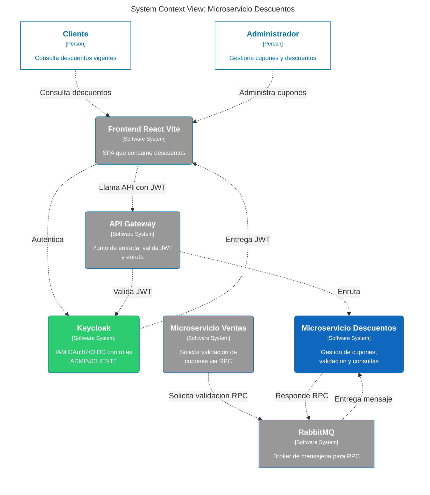
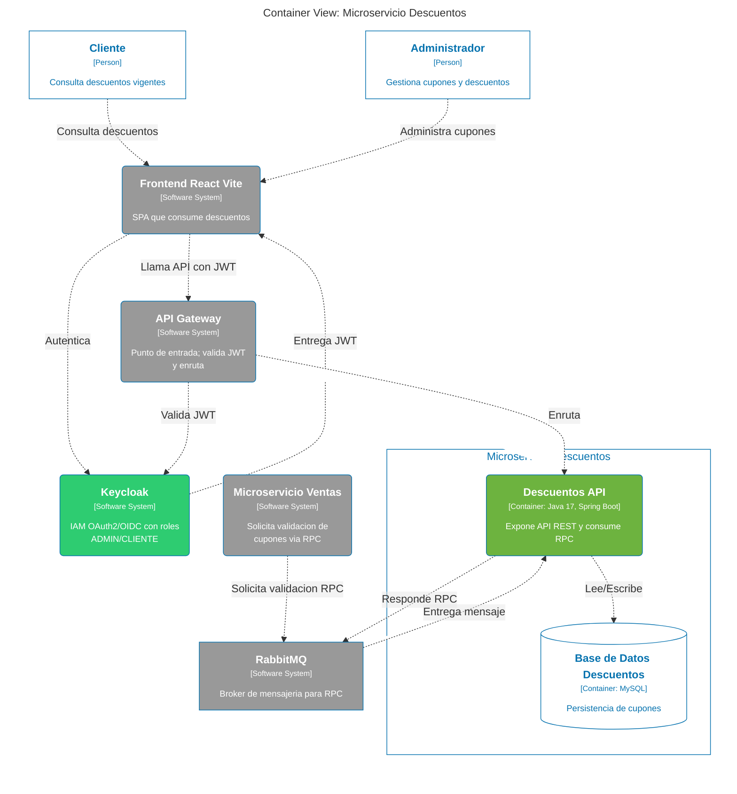
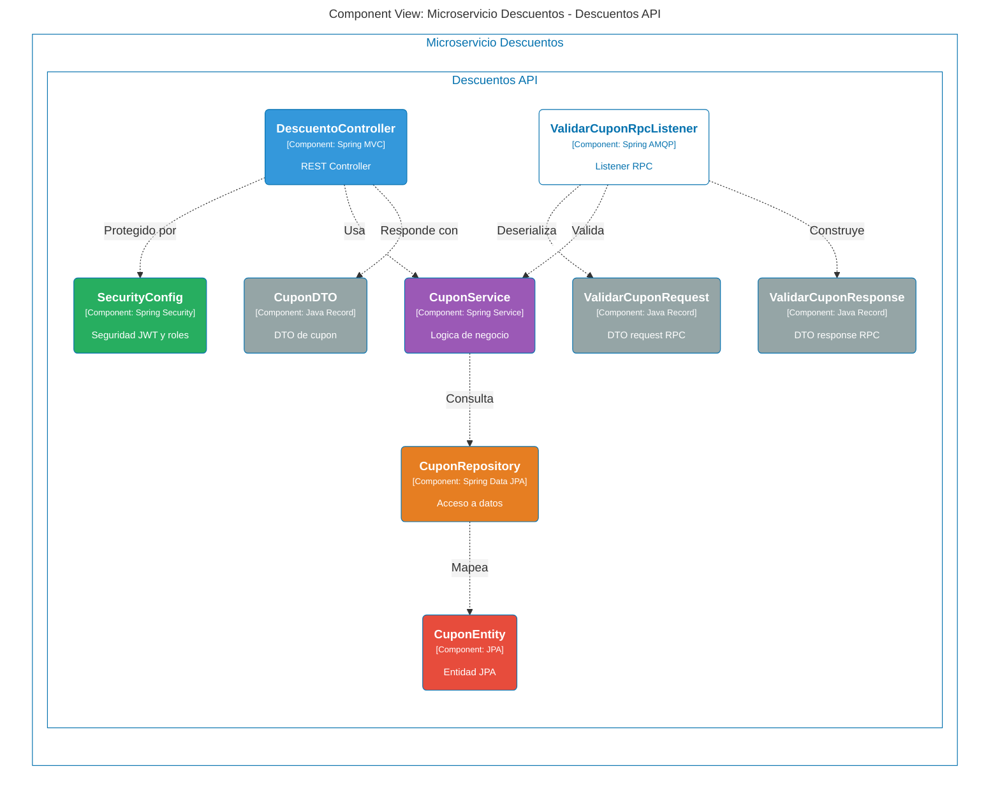

# 🎟️ Microservicio de Descuentos - El Almacén de Películas Online

Microservicio REST dedicado a la gestión y validación de cupones de descuento para la plataforma de alquiler de películas online.

## 📋 Descripción

Este vertical forma parte de una arquitectura de microservicios y se encarga exclusivamente de:
- Validar cupones de descuento por código
- Gestionar la creación de nuevos cupones
- Listar cupones disponibles y vigentes
- Verificar vigencia temporal de descuentos
- Responder consultas RPC desde otros servicios vía RabbitMQ


## Arquitectura del Sistema (Modelo C4)

### Nivel 1: Contexto


### Nivel 2: Contenedores


### Nivel 3: Componentes (API & RabbitMQ)


graph TD
  subgraph "Contexto del Sistema"
    %% Aquí podés pegar el contenido de structurizr-Contexto.mmd
    %% O simplemente referenciar la lógica del diagrama
  end

## 🏗️ Arquitectura del Proyecto

El proyecto sigue una **arquitectura hexagonal** (puertos y adaptadores) organizada en capas:

```
src/main/java/unrn/
│
├── api/                                    # 🌐 Capa de presentación (REST Controllers)
│   └── DescuentoController.java            # Endpoints HTTP
│
├── service/                                # 💼 Capa de lógica de negocio
│   └── CuponService.java                   # Validación y gestión de cupones
│
├── dto/                                    # 📦 Objetos de transferencia de datos
│   ├── CuponDTO.java                       # DTO para comunicación API
│   ├── ValidarCuponRequest.java            # Request RPC para validar cupón
│   └── ValidarCuponResponse.java           # Response RPC con resultado de validación
│
├── model/                                  # 🎯 Modelos de dominio
│   └── Cupon.java                          # Entidad de negocio con validaciones
│
├── infra/persistence/                      # 🗄️ Capa de infraestructura (Persistencia)
│   ├── CuponEntity.java                    # Entidad JPA
│   ├── CuponRepository.java                # Repositorio personalizado
│   └── CuponJpaRepository.java             # Interfaz Spring Data JPA
│
├── event/descuento/                        # 📨 Capa de mensajería (RabbitMQ)
│   └── ValidarCuponRpcListener.java        # Listener RPC para validación de cupones
│
├── config/                                 # ⚙️ Configuración de la aplicación
│   ├── RabbitMQConfig.java                 # Configuración de exchanges, colas y bindings
│   └── SecurityConfig.java                 # Configuración de seguridad OAuth2/JWT
│
└── app/                                    # 🚀 Punto de entrada
    └── ElAlmacenDePeliculasOnlineDescuentosApplication.java
```

## 🛠️ Stack Tecnológico

### Framework Principal
- **Spring Boot 3.4.2** - Framework de aplicaciones Java
- **Java 17** - Versión LTS del lenguaje

### Dependencias Core
| Tecnología | Propósito |
|-----------|-----------|
| **Spring Web MVC** | API REST y controladores HTTP |
| **Spring Data JPA** | Persistencia y acceso a datos |
| **Spring Security OAuth2 Resource Server** | Autenticación JWT con Keycloak |
| **Spring AMQP** | Mensajería asíncrona y RPC con RabbitMQ |
| **Springdoc OpenAPI (Swagger UI)** | Documentación interactiva de la API |

### Base de Datos
- **MySQL 8 / MariaDB** - Sistema de gestión de bases de datos relacional
- **MySQL Connector/J** - Driver JDBC para MySQL

### Herramientas de Desarrollo
- **Lombok** - Reducción de código boilerplate
- **Maven** - Gestión de dependencias y construcción del proyecto
- **Docker** - Contenerización de la aplicación

## 🔐 Seguridad

El microservicio está protegido con **OAuth 2.0 + JWT**:

- **Servidor de autenticación:** Keycloak
- **Realm:** `videoclub`
- **Issuer URI (local):** `http://localhost:9090/realms/videoclub`
- **Issuer URI (Docker):** `http://keycloak-sso:8080/realms/videoclub`
- **Tipo de token:** Bearer JWT

Los endpoints **GET** de `/descuentos/**` y la documentación Swagger son públicos. El endpoint **POST** `/descuentos/crear` requiere un token válido:
```bash
Authorization: Bearer <access_token>
```

## 🗄️ Base de Datos

**Nombre de la BD:** `db_descuentos`

### Esquema de la tabla `cupon`

| Campo | Tipo | Descripción |
|-------|------|-------------|
| `id` | INT (PK, Auto) | Identificador único |
| `nombre` | VARCHAR(15) UNIQUE | Código del cupón |
| `fechaInicio` | DATE | Inicio de vigencia |
| `fechaFin` | DATE | Fin de vigencia |
| `porcentaje` | FLOAT | Descuento en porcentaje (0-100) |

### Script SQL de ejemplo

El archivo `sql/import.sql` contiene el esquema completo con datos de ejemplo:

```sql
CREATE TABLE `cupon` (
  `id` int(11) NOT NULL,
  `nombre` varchar(15) NOT NULL UNIQUE,
  `fechaInicio` date NOT NULL,
  `fechaFin` date NOT NULL,
  `porcentaje` float NOT NULL
) ENGINE=InnoDB DEFAULT CHARSET=utf8mb4 COLLATE=utf8mb4_general_ci;

INSERT INTO `cupon` (`id`, `nombre`, `fechaInicio`, `fechaFin`, `porcentaje`) VALUES
(1, 'CINE20', '2026-01-01', '2026-12-31', 20),
(2, 'NUEVO50', '2026-03-01', '2026-03-31', 50);
```

## 🚀 Ejecución del Proyecto

### Prerrequisitos

1. **Java 17** instalado
2. **MySQL 8 / MariaDB** ejecutándose en `localhost:3306`
3. **RabbitMQ** ejecutándose en `localhost:5672`
4. **Keycloak** ejecutándose en `localhost:9090` con el realm `videoclub` configurado
5. Base de datos `db_descuentos` creada con el script `sql/import.sql`

### Compilar y ejecutar

```bash
# Compilar el proyecto
./mvnw clean install

# Ejecutar la aplicación
./mvnw spring-boot:run
```

El servicio estará disponible en: **http://localhost:8085**

### 🐳 Ejecución con Docker

```bash
# Construir la imagen
./mvnw clean package -DskipTests
docker build -t descuentos-service .

# Ejecutar el contenedor con el perfil Docker
docker run -p 8085:8085 \
  -e SPRING_PROFILES_ACTIVE=docker \
  descuentos-service
```

> En el perfil `docker`, el servicio se conecta a `descuentos-mysql:3306`, `shared-rabbitmq:5672` y `keycloak-sso:8080`.

## ✅ Pruebas y Cobertura

Este proyecto incluye una suite principal que ejecuta todos los tests del microservicio:
- `src/test/java/unrn/ElAlmacenDePeliculasOnlineDescuentosApplicationTests.java`

### Ejecutar todos los tests (Maven)

```bash
mvn clean test
```

### Ejecutar tests con reporte de cobertura (JaCoco)

```bash
mvn clean test jacoco:report
```

### Ejecutar con Coverage en IntelliJ

1. Abre `src/test/java/unrn/ElAlmacenDePeliculasOnlineDescuentosApplicationTests.java`
2. Click derecho en la clase
3. Selecciona "Run 'ElAlmacenDePeliculasOnlineDescuentosApplicationTests' with Coverage"

> Nota: ejecutar un test individual con Coverage solo mide lo que ese test ejecuta.

## 📡 API Endpoints

### 🔹 Health Check
```http
GET /descuentos/test
```
**Respuesta:**
```json
{
  "status": "OK",
  "message": "Servicio de Descuentos operando en el puerto 8085"
}
```

### 🔹 Validar Cupón
```http
GET /descuentos/validar?codigo=CINE20
```
**Respuesta exitosa (200):**
```json
{
  "id": 1,
  "nombre": "CINE20",
  "porcentaje": 20.0,
  "fechaInicio": "2026-01-01",
  "fechaFin": "2026-12-31"
}
```
**Respuesta sin cupón válido (404):**
```
Not Found
```

### 🔹 Listar Todos los Cupones
```http
GET /descuentos/listar
```
**Respuesta (200):**
```json
[
  {
    "id": 1,
    "nombre": "CINE20",
    "porcentaje": 20.0,
    "fechaInicio": "2026-01-01",
    "fechaFin": "2026-12-31"
  },
  {
    "id": 2,
    "nombre": "NUEVO50",
    "porcentaje": 50.0,
    "fechaInicio": "2026-03-01",
    "fechaFin": "2026-03-31"
  }
]
```
**Sin cupones (204):** No Content

### 🔹 Listar Cupones Vigentes
```http
GET /descuentos/listar-vigentes
```
Devuelve únicamente los cupones cuya fecha actual se encuentra dentro del rango `fechaInicio` - `fechaFin`.

**Respuesta (200):** misma estructura que `/listar`  
**Sin cupones vigentes (204):** No Content

### 🔹 Crear Cupón
```http
POST /descuentos/crear
Authorization: Bearer <token>
Content-Type: application/json

{
  "nombre": "NAVIDAD2026",
  "porcentaje": 15.0,
  "fechaInicio": "2026-12-01",
  "fechaFin": "2026-12-31"
}
```
**Respuesta (201):**
```json
{
  "id": 3,
  "nombre": "NAVIDAD2026",
  "porcentaje": 15.0,
  "fechaInicio": "2026-12-01",
  "fechaFin": "2026-12-31"
}
```
**Error de validación (400):** Bad Request

## 📚 Documentación Swagger UI

La documentación interactiva de la API está disponible en:

```
http://localhost:8085/swagger-ui/index.html
```

Los endpoints de Swagger son públicos y no requieren autenticación.

## 📨 Mensajería RabbitMQ (RPC)

El microservicio escucha mensajes RPC en la cola `descuentos.cupon.validar.queue` para responder consultas de validación de cupones desde otros servicios.

### Configuración de mensajería

| Parámetro | Valor local | Valor Docker |
|-----------|-------------|--------------|
| Host | `localhost` | `shared-rabbitmq` |
| Puerto | `5672` | `5672` |
| Exchange | `descuentos.exchange` | `descuentos.exchange` |
| Cola | `descuentos.cupon.validar.queue` | `descuentos.cupon.validar.queue` |
| Routing Key | `descuentos.cupon.validar` | `descuentos.cupon.validar` |

### Formato del mensaje RPC

**Request** (`ValidarCuponRequest`):
```json
{ "nombreCupon": "CINE20" }
```

**Response** (`ValidarCuponResponse`):
```json
{
  "valido": true,
  "porcentajeDescuento": 20.0,
  "vigenteDesde": "2026-01-01",
  "vigenteHasta": "2026-12-31",
  "motivo": null
}
```

## 🔑 Autenticación con Keycloak

### Obtener un token de acceso

```bash
curl -X POST "http://localhost:9090/realms/videoclub/protocol/openid-connect/token" \
  -H "Content-Type: application/x-www-form-urlencoded" \
  -d "grant_type=password" \
  -d "client_id=web" \
  -d "username=<tu_usuario>" \
  -d "password=<tu_password>"
```

### Usar el token en las peticiones

```bash
curl -X POST "http://localhost:8085/descuentos/crear" \
  -H "Authorization: Bearer <access_token>" \
  -H "Content-Type: application/json" \
  -d '{"nombre":"NAVIDAD2026","porcentaje":15.0,"fechaInicio":"2026-12-01","fechaFin":"2026-12-31"}'
```

## 📄 Licencia

Este proyecto es parte de un sistema académico/empresarial privado.

---

⭐ **¡Gracias por usar el Microservicio de Descuentos!** ⭐
